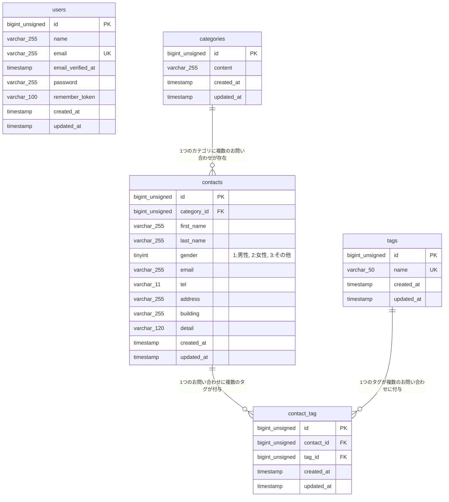

# COACHTECH お問い合わせフォーム

## 概要
本システムは、一般ユーザーが問い合わせを送信できる公開問い合わせフォームと、管理者がログイン後に問い合わせデータの閲覧・検索・管理（CSVエクスポート・タグ管理等）を行うWebアプリケーションです。外部連携用にRESTful APIエンドポイントも実装しています。

## 作成者
松井　義朗

## 開発環境URL
- Webアプリケーション: http://localhost
- phpMyAdmin: http://localhost:8080

## 使用技術
- **OS**: Docker環境（Linux）
- **PHP**: 8.2
- **Framework**: Laravel 10.x
- **Database**: MySQL 8.0
- **Web Server**: Nginx
- **Frontend**: Vite, Tailwind CSS (^3.4.0), Alpine.js
- **Dev Tools**: Docker, Laravel Sail, phpMyAdmin

## ER図



## 環境構築手順

### 1. リポジトリのクローン
```bash
git clone https://github.com/Yoshi14-M/contact-form-app.git
cd contact-form-app
```

### 2. 環境変数の設定
```bash
cp .env.example .env
```
`.env` ファイル内のDB接続情報が以下になっていることを確認します。
```env
DB_CONNECTION=mysql
DB_HOST=mysql
DB_PORT=3306
DB_DATABASE=laravel
DB_USERNAME=sail
DB_PASSWORD=password
```

### 3. Dockerコンテナ（Sail）の起動
```bash
./vendor/bin/sail up -d
```

### 4. アプリケーションキーの生成
```bash
sail artisan key:generate
```

### 5. フロントエンドパッケージのインストールとビルド
```bash
sail npm install
sail npm run dev
```

### 6. マイグレーションと初期データ投入
```bash
sail artisan migrate:fresh --seed
```

---

## APIエンドポイント一覧

| メソッド | パス | 概要 | 認証 |
| :--- | :--- | :--- | :--- |
| `GET` | `/api/v1/contacts` | お問い合わせ一覧取得（検索・ページネーション対応） | 不要 |
| `GET` | `/api/v1/contacts/{contact}` | お問い合わせ詳細取得（カテゴリ・タグ含む） | 不要 |
| `POST` | `/api/v1/contacts` | お問い合わせ新規作成 | 不要 |
| `PUT` | `/api/v1/contacts/{contact}` | お問い合わせ更新 | 不要 |
| `DELETE` | `/api/v1/contacts/{contact}` | お問い合わせ削除 | 不要 |
